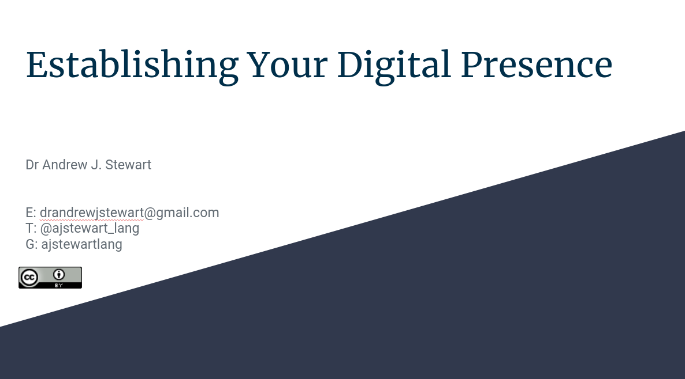

```{r setup, include=FALSE}
knitr::opts_chunk$set(echo = TRUE)
```

# Overview

Establishing a digital presence is important as it allows you to have some control over how you are presented when others (such as potential employers and collaborators) search for you. Making good use of social media (such as Twitter) allows you to be aware of important conversations that are occurring in your field, and to discover what other people are discussing. 

In this workshop we are going to focus on building your own website to allow others to find out about your academic background, research interests etc. We will look at two approaches. The first involves building a website using [WordPress](https://wordpress.com/), while the second involves building a website using the `{blogdown}` package in R. While the Wordpress option is the most straightforward, the `{blogdown}` alternative allows you to have more control over how your website functions. With `{blogdown}` you are essentially writing your website content in Markdown and can connect your website to GitHub for version control and continuous deployment (CD) via Netlify. CD allows you to edit your website, push the changes to GitHub and then have Netlify rebuild your website automatically. You can read more about `{blogdown}` [here](https://bookdown.org/yihui/blogdown/).

My [website](https://ajstewartlang.netlify.app/) was written using the `{blogdown}` package. Most of the underlying code for displaying your website will be generated automatically by `{blogdown}`. You mainly just have to write the content (plus tweak a few configuration settings). You can see the full code behind my site [here](https://github.com/ajstewartlang/website).

&nbsp;&nbsp;

<center>

<iframe width="560" height="315" src="https://youtube.com/embed/bennZgrDVzI" frameborder="0" allowfullscreen></iframe>

</center>
&nbsp;&nbsp;

You can download the slides in .odp format by clicking [here](../slides/digital_presence.odp) and in .pdf format by clicking on the image below. 

&nbsp;&nbsp;

<center>

[{width=75%}](../slides/99_establishing_your_digital_presence.pdf)

</center>

&nbsp;&nbsp;

## Your Challenge

In our Zoom class, I'd like you to build your own website to present your professional profile. You could write a little about yourself in terms of research background and interest. If you have a cv handy, you could re-create that in your website or link to a .pdf version of it. If you've taken part in any of the R Tidy Tuesday challenges, you could render your code and output using R Markdown and then upload that .html page to your website.  

## Improve this Workshop

If you spot any issues/errors in this workshop, you can raise an issue or create a pull request for [this repo](https://github.com/ajstewartlang/99_establishing_your_digital_presence). 